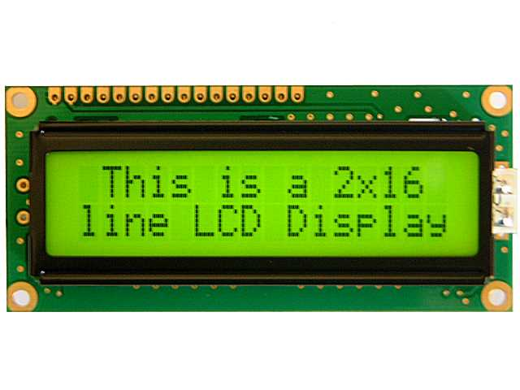
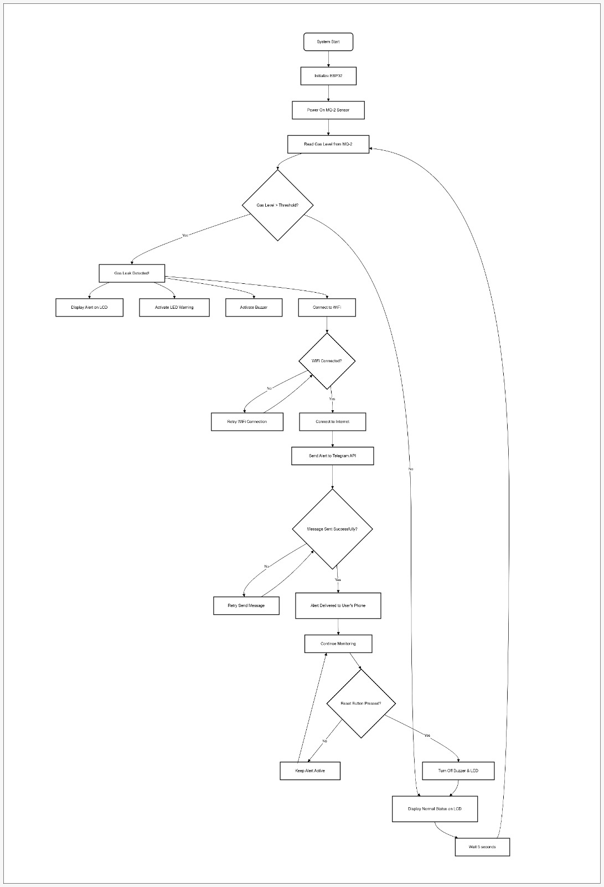

# 🚨 IoT-Based Gas Leak Detection and Alert System (ESP32 + MQ-2)

## 👥 Kelompok 16
- Alghifari Rasyid Zola (105222006)  
- Raihan Akira Rahmaputra (105222040)

---

## 📌 Deskripsi Singkat
Sistem ini merupakan alat pendeteksi kebocoran gas berbasis IoT yang menggunakan sensor MQ-2 yang terpasang pada ESP32 dengan pemrograman MicroPython. Ketika sensor mendeteksi gas berbahaya seperti LPG, metana, atau asap dalam jumlah berlebih, sistem akan mengaktifkan buzzer dan LED sebagai peringatan di lokasi.
Sistem ini juga dilengkapi dengan LCD 16x2 yang menampilkan informasi real-time seperti kadar gas yang terdeteksi, nilai ambang batas (threshold), serta kondisi sistem. Jika kadar gas berada di bawah ambang batas, LCD akan menampilkan tulisan "Kondisi Normal". Namun, jika terdeteksi kadar gas melebihi threshold, LCD akan menampilkan peringatan "Gas bocor terdeteksi".
Selain peringatan lokal, sistem juga mengirimkan notifikasi secara real-time ke akun Telegram pengguna, sehingga pengguna tetap mendapatkan peringatan jarak jauh meskipun tidak berada di lokasi.
Sebagai fitur tambahan, sistem ini juga dilengkapi dengan web server sederhana yang dijalankan oleh ESP32. Web server ini dapat diakses melalui alamat IP lokal perangkat ketika terhubung ke jaringan WiFi yang sama. Melalui web interface ini, pengguna dapat memantau data sensor secara real-time menggunakan browser, sehingga memberikan alternatif pemantauan tambahan tanpa perlu berada di depan perangkat secara langsung.
Dengan kombinasi antara peringatan visual melalui LCD, audio-visual lokal dengan buzzer dan LED, notifikasi jarak jauh melalui Internet, serta pemantauan real-time melalui web server lokal, sistem ini dirancang sebagai solusi deteksi dini yang efektif untuk mencegah kebakaran akibat kebocoran gas.

---

## 🎯 Tujuan
- Mendeteksi kebocoran gas secara real-time dengan sensor MQ-2.
- Memberikan peringatan lokal melalui LED dan buzzer.
- Memberikan peringatan visual melalui LCD.
- Mengirim alert message ke Telegram sebagai pengingat jarak jauh.
- Meningkatkan keselamatan rumah tangga/tempat usaha dari risiko kebakaran gas.
- Mendukung penerapan IoT untuk menciptakan lingkungan yang aman dan berkelanjutan.

---

## 🌍 Target SDGs
**SDG 11 – Sustainable Cities and Communities**  
Proyek ini mendukung SDG 11 dengan meningkatkan keamanan lingkungan dari risiko kebocoran gas, menciptakan kota yang lebih aman, tangguh, dan berkelanjutan.

---

## 📦 Daftar Komponen

| No | Komponen                | Gambar                                                                 | Fungsi                                                                 |
|----|-------------------------|------------------------------------------------------------------------|------------------------------------------------------------------------|
| 1  | ESP32                   |  | Mikrokontroler utama, koneksi WiFi, kontrol sensor & aktuator         |
| 2  | Sensor Gas MQ-2         |  | Deteksi gas LPG, metana, asap, dan hidrogen                           |
| 3  | LED                     |  | Indikator visual saat gas terdeteksi                                  |
| 4  | Buzzer                  |  | Alarm suara sebagai peringatan lokal                                  |
| 5  | Breadboard              |  | Media penyambung komponen sementara                                   |
| 6  | Kabel Jumper            |  | Penghubung antar komponen                                              |
| 7  | Resistor (220–330Ω)     |  | Pembatas arus ke LED                                                  |
| 8  | LCD Display             |  | Menampilkan informasi pada LCD                                        |
| 9  | Kabel Micro USB         |  | Koneksi ESP32 ke komputer/laptop                                      |
| 10  | Koneksi WiFi           |  | Untuk mengirim pesan ke Telegram                                       |
| 11 | Telegram + Bot API      |  | Menerima alert melalui bot Telegram                                   |

---

## 📷 Diagram Blok Sistem

Sistem deteksi kebocoran gas ini mengikuti alur kerja yang terpadu dengan ESP32 sebagai pusat kendali utama yang pada tahap development dan testing prototype ini mendapat catu daya melalui koneksi USB dari laptop untuk menjamin operasional seluruh komponen. Proses dimulai ketika terjadi kebocoran gas di lingkungan. Gas yang bocor ini kemudian terdeteksi oleh sensor MQ-2, yang dirancang khusus untuk mengenali keberadaan gas-gas berbahaya seperti LPG, propana, hidrogen, dan gas mudah terbakar lainnya di udara. Setelah mendeteksi adanya kebocoran gas, sensor MQ-2 mengirimkan data analog pengukuran ke mikrokontroler ESP32.
ESP32 bertindak sebagai otak dari sistem ini, memproses data yang diterima dari sensor dan secara simultan menampilkan status sistem melalui LCD Display 16x2 yang memberikan informasi real-time kepada pengguna di lokasi. Berdasarkan data dari sensor MQ-2, ESP32 kemudian mengeksekusi empat tindakan penting secara terkoordinasi: Pertama, ESP32 memperbarui tampilan status pada LCD Display untuk memberikan informasi visual lokal. Kedua, ESP32 mengaktifkan buzzer untuk memberikan peringatan audible yang dapat didengar di lokasi kejadian. Ketiga, ESP32 mengaktifkan LED sebagai indikator visual untuk memberikan peringatan yang dapat dilihat. Keempat, melalui WiFi Module yang terintegrasi, ESP32 terhubung ke internet dan mengirimkan pesan peringatan kepada pengguna melalui Telegram API, memungkinkan notifikasi cepat dan pemantauan jarak jauh dari situasi berbahaya tersebut.
Sebagai fitur tambahan, ESP32 juga menjalankan web server sederhana yang dapat diakses melalui IP address perangkat di jaringan WiFi lokal, menampilkan data sensor terkini secara real-time untuk monitoring tambahan melalui browser web. Keberadaan komponen-komponen dalam sistem ini memiliki nilai tambah karena berkontribusi pada pencapaian Sustainable Development Goals (SDGs), khususnya dalam aspek peningkatan keamanan, pencegahan kecelakaan, dan pengembangan infrastruktur yang tangguh terhadap bencana terkait kebocoran gas. Dengan arsitektur yang terpusat pada sensor MQ-2 untuk deteksi, ESP32 untuk koordinasi respons dan web server lokal, serta LCD untuk display lokal, sistem ini memberikan mekanisme keamanan yang komprehensif, terintegrasi, dan responsif dengan multiple interface monitoring baik melalui display fisik maupun web interface lokal.

---
## Flowchart

---

## 🛠️ Teknologi
- ESP32 dengan MicroPython
- Sensor MQ-2
- Telegram Bot API
- Buzzer + LED
- LCD
- Breadboard prototyping

---

## 📄 Lisensi
Proyek ini dibuat untuk keperluan akademik. Silakan gunakan, ubah, dan distribusikan dengan menyertakan kredit kepada pembuat asli.

---

