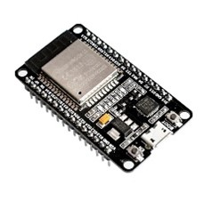
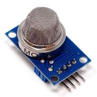
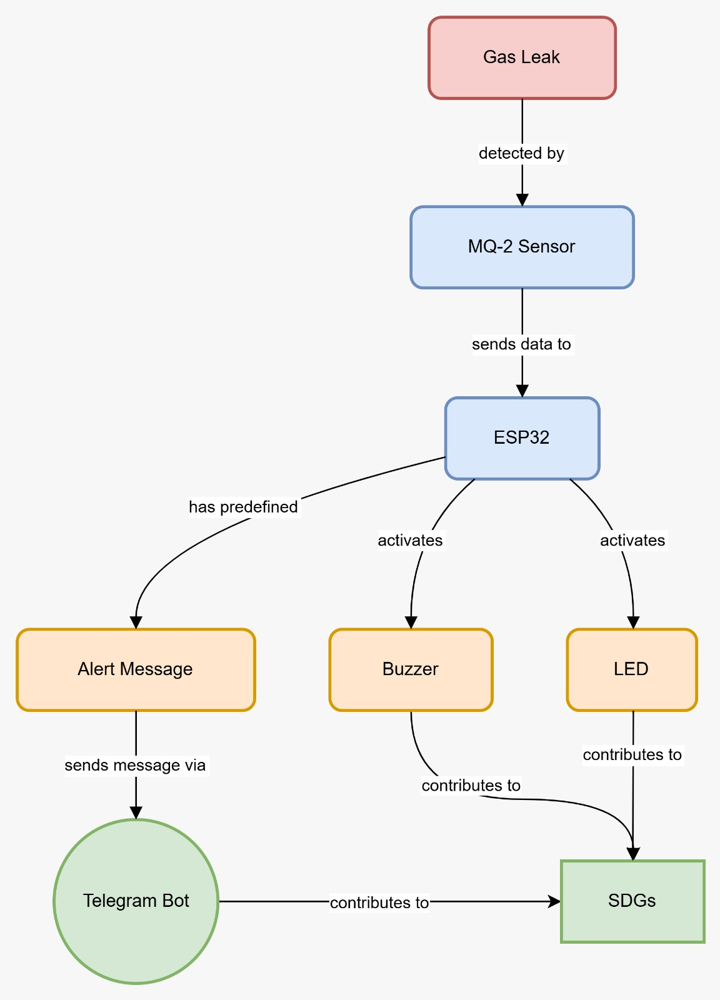

# 🚨 IoT-Based Gas Leak Detection and Alert System (ESP32 + MQ-2)

## 👥 Kelompok 16
- Alghifari Rasyid Zola (105222006)  
- Raihan Akira Rahmaputra (105222040)

---

## 📌 Deskripsi Singkat
Sistem ini merupakan alat pendeteksi kebocoran gas berbasis IoT yang menggunakan sensor MQ-2 yang terpasang pada ESP32 dengan pemrograman MicroPython. Ketika sensor mendeteksi gas berbahaya seperti LPG, metana, atau asap dalam jumlah berlebih, sistem akan mengaktifkan buzzer dan LED sebagai peringatan di lokasi. Selain itu, sistem juga mengirimkan notifikasi secara real-time ke akun Telegram pengguna untuk memberikan peringatan jarak jauh. Sistem ini dirancang sebagai solusi dini untuk mencegah kebakaran akibat kebocoran gas.

---

## 🎯 Tujuan
- Mendeteksi kebocoran gas secara real-time dengan sensor MQ-2.
- Memberikan peringatan lokal melalui LED dan buzzer.
- Mengirim alert message ke Telegram sebagai pengingat jarak jauh.
- Meningkatkan keselamatan rumah tangga/tempat usaha dari risiko kebakaran gas.
- Mendukung penerapan IoT untuk menciptakan lingkungan yang aman dan berkelanjutan.

---

## 🌍 Target SDGs
**SDG 11 – Sustainable Cities and Communities**  
Proyek ini mendukung SDG 11 dengan meningkatkan keamanan lingkungan dari risiko kebocoran gas, menciptakan kota yang lebih aman, tangguh, dan berkelanjutan.

---

## 📦 Daftar Komponen

| No | Komponen                | Gambar                                                                 | Fungsi                                                                 |
|----|-------------------------|------------------------------------------------------------------------|------------------------------------------------------------------------|
| 1  | ESP32                   |  | Mikrokontroler utama, koneksi WiFi, kontrol sensor & aktuator         |
| 2  | Sensor Gas MQ-2         |  | Deteksi gas LPG, metana, asap, dan hidrogen                           |
| 3  | LED                     |  | Indikator visual saat gas terdeteksi                                  |
| 4  | Buzzer                  |  | Alarm suara sebagai peringatan lokal                                  |
| 5  | Breadboard              |  | Media penyambung komponen sementara                                   |
| 6  | Kabel Jumper            |  | Penghubung antar komponen                                              |
| 7  | Resistor (220–330Ω)     |  | Pembatas arus ke LED                                                  |
| 8  | Kabel Micro USB         |  | Koneksi ESP32 ke komputer/laptop                                      |
| 9  | Koneksi WiFi            |  | Untuk mengirim pesan ke Telegram                                       |
| 10 | Telegram + Bot API      |  | Menerima alert melalui bot Telegram                                   |

---

## 📷 Diagram Blok Sistem

Sistem deteksi kebocoran gas ini mengikuti alur kerja yang terpadu dengan ESP32 sebagai pusat kendali utama. Proses dimulai ketika terjadi kebocoran gas di lingkungan. Gas yang bocor ini kemudian terdeteksi oleh sensor MQ-2, yang dirancang khusus untuk mengenali keberadaan gas-gas berbahaya seperti LPG, propana, hidrogen, dan gas mudah terbakar lainnya di udara.
Setelah mendeteksi adanya kebocoran gas, sensor MQ-2 mengirimkan data pengukuran ke mikrokontroler ESP32. ESP32 bertindak sebagai otak dari sistem ini, memproses data yang diterima dari sensor. Dalam ESP32 sudah terdapat pesan peringatan (alert message) yang telah didefinisikan sebelumnya, siap untuk dikirimkan ketika kondisi kebocoran gas terdeteksi.
Berdasarkan data dari sensor MQ-2, ESP32 kemudian mengeksekusi empat tindakan penting secara terkoordinasi:
Pertama, ESP32 mengaktifkan buzzer untuk memberikan peringatan audible yang dapat didengar di lokasi kejadian. Kedua, ESP32 juga mengaktifkan LED sebagai indikator visual untuk memberikan peringatan yang dapat dilihat. Ketiga, ESP32 mengirimkan pesan peringatan yang sudah tersedia langsung kepada pengguna melalui Telegram Bot, tanpa perlu membuat pesan baru. Ini memungkinkan notifikasi cepat dan pemantauan jarak jauh dari situasi berbahaya tersebut.
Keberadaan LED dalam sistem ini juga memiliki nilai tambah karena berkontribusi pada pencapaian Sustainable Development Goals (SDGs), khususnya dalam aspek peningkatan keamanan, pencegahan kecelakaan, dan pengembangan infrastruktur yang tangguh terhadap bencana terkait kebocoran gas.
Dengan arsitektur yang terpusat pada sensor MQ-2 untuk deteksi dan ESP32 untuk koordinasi respons, sistem ini memberikan mekanisme keamanan yang komprehensif, terintegrasi, dan responsif. ESP32 dapat langsung menggunakan template pesan yang sudah tersedia untuk komunikasi dengan pengguna melalui Telegram Bot, menghasilkan waktu respons yang lebih cepat dalam situasi darurat.

---

## 🛠️ Teknologi
- ESP32 dengan MicroPython
- Sensor MQ-2
- Telegram Bot API
- Buzzer + LED
- Breadboard prototyping

---

## 📄 Lisensi
Proyek ini dibuat untuk keperluan akademik. Silakan gunakan, ubah, dan distribusikan dengan menyertakan kredit kepada pembuat asli.

---

## 🙌 Kontribusi

